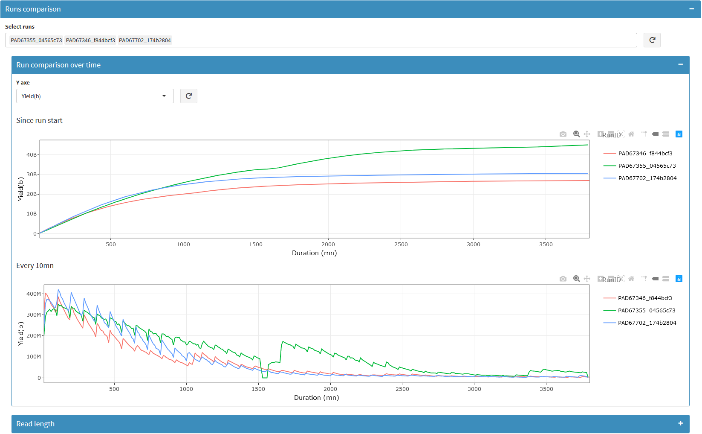

# BoardION web interface

BoardION's interface is composed of 3 pages:
- Runs in progress: displays runs that are currently sequenced
- Sequencing overview: shows final metrics of all run and allows you to compare them
- Run: more informations and plots on a selected run

## Plots

All the graphs are made with plotly and are therefore dynamic. To allow you to explore the data without the graph refreshing every few minutes, graphs in the sequencing overview page and run page are not refresh automatically. Instead there is a button next to each graph to refresh the data and the selection of axes: 

## Runs in progress view

This page show for each run currently sequenced 2 graphs:
- the yield over time
- the read length distribution

Each run is displayed in a separate box which can be expended/reduced using the '+'/'-' in the top right corner.

> the more boxes you open, the longer it'll take to refresh the data, as there is more graph to draw.

Between the table and the first run, there is a toggle button. This button is used for switch between cumulative and non-cumualative mode for the yield graph.

## Sequencing overview

This page is divided in 2 parts, the overview and the run comparison.

### Overview

On this graph point is a run. You can select which statistic to display with the 2 dropdown lists.

You can also bin the abscisse using the slider bar, for example here the n50 in function of the quality binned every 1 quality:

### Run comparison

In this part you can select multiple run (with the dropown list at the top of the box) and compare them ith 3 different graphs:
- distribution over time with statistic computed since the start of the run for each step (by default a step last 10 min)
- distribution over time with statistic computed separatly for each step (by default a step last 10 min)
- distribution of the reads length

## Run view

On this you can select run to view more statistic on it. It is divided in two tabs:
- the first one containing statstics for each step since the start of the run (for example on the yield graph below each bar represent all reads from the start of the run until this bar, that's mean the color of the last bar represent the mean quality of the whole run)
- the second contain statistics on the reads sequenced only in the step

The channel view show for each channel statistics on the reads sequenced by it. Therefore if the run is in sequencing, this graph doe not show the current state of the channel.
